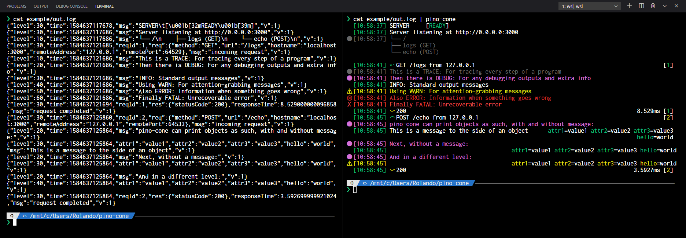

# pino-cone&nbsp;&nbsp;&nbsp;&nbsp;&nbsp;

ndjson formatter for [pino](https://www.npmjs.com/package/pino), used best with [fastify](https://www.fastify.io/)
Based on [pino-pretty-min](https://www.npmjs.com/package/pino-pretty-min)

## Features

- Detection and formatting of Incoming Request and Outgoing Response for Fastify
- Formatted Error and Object printing
- Accepts input using pipe

## Installation

Install through npm

`npm install -g pino-cone`

## Usage

Pipe ndjson data into it by either redirecting your program's output or reading a log file

`npm start | pino-cone`

Or if your log file is named "out.log"

`tail -f out.log | pino-cone`

## Planned Features

- Colorization Settings
- Load as fastify plugin

## Release Notes

Check [CHANGELOG.md](https://github.com/rolandostar/pino-cone/blob/master/CHANGELOG.md)

<h2>Contact</h2>

You can find me on Discord: rolandostar@8942</a> and <a href="https://www.reddit.com/user/rolandostar">Reddit</a>!

If you like this extension, please consider a small donation.

